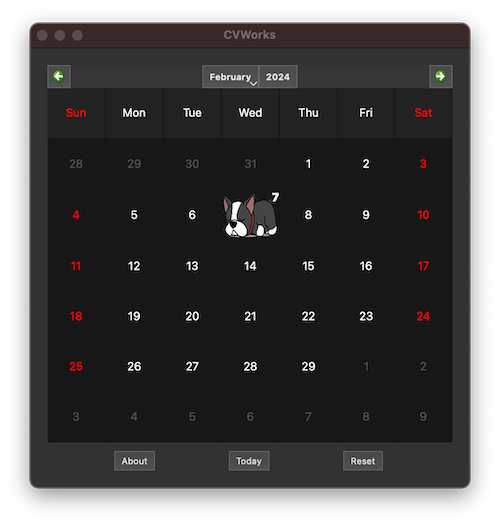
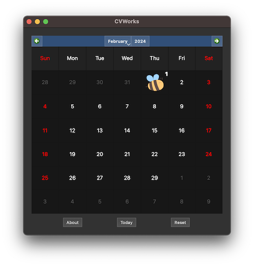
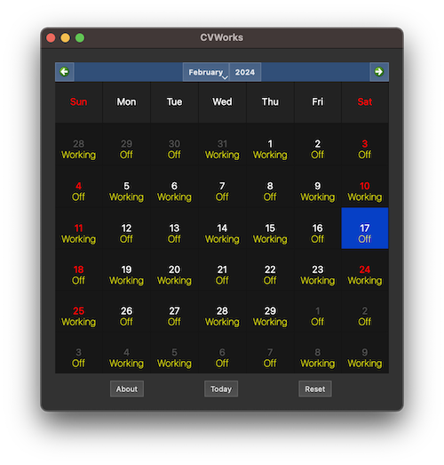

# CVWorks

An interactive calendar indicating whether CV is working or off. 
 
Just click a date and see what you get.
  
### Keyboard Shortcuts:

- CTRL-A - About
- CTRL-M - Switch between graphical and textual modes
- CTRL-R - Reset screen position and dimensions
- CTRL-T - Jump to today's date
   
### Screenshots:
 

#### - Graphical Mode

Nope, I'm off today.

Bumber, It's my turn.

#### - Text Mode

